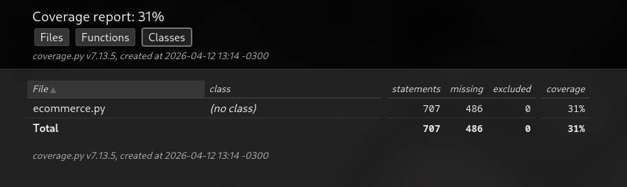
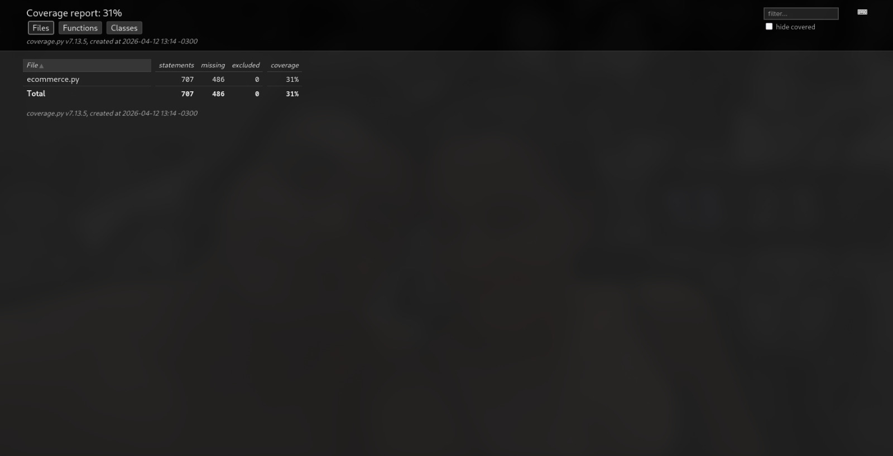
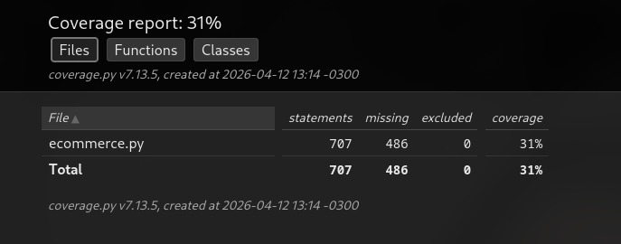
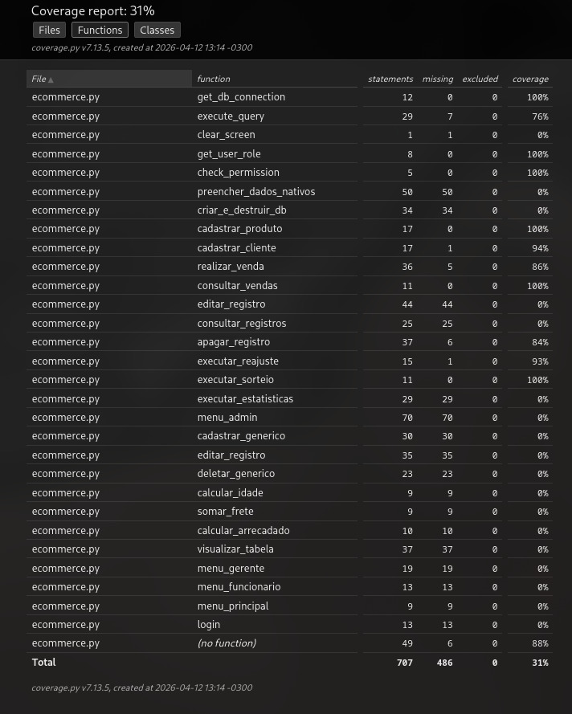

# Ecommerce 

se quiserem ver o resultado deste primeiro teste ele esta em .results no arquivo tomaaaa.txt

Para abrir o relatorio html pode rodar um
firefox htmlcov/index.html
deppois de clonar este repo

abaixo esta a prints do relatrio html do 

pytest --cov=ecommerce --cov-report=html test_ecommerce.py

